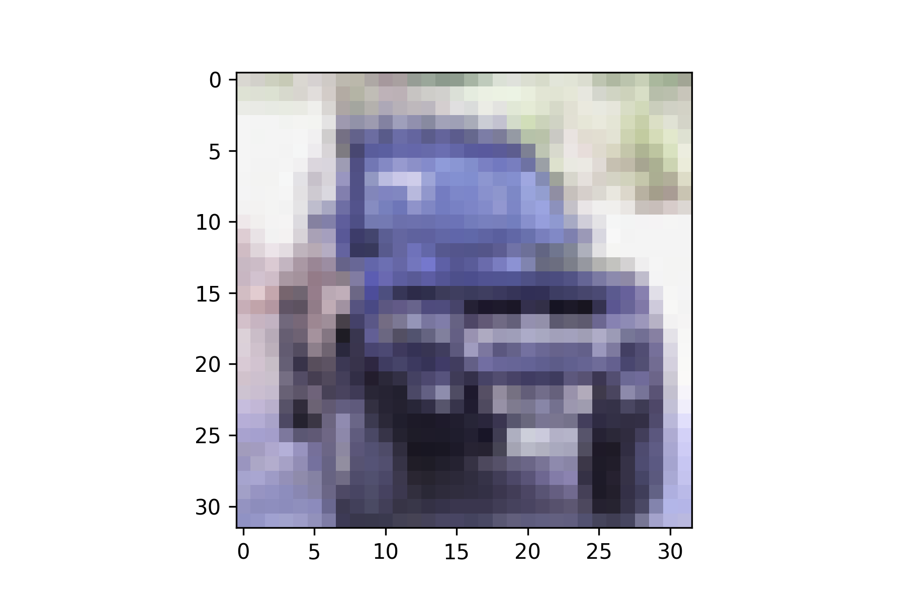

# CIFAR10 분류기를 FastAPI를 사용해 배포

### Structure

```bash
.
├── README.md
├── app
│   └── app.py
├── model
│   ├── labels.json
│   └── tf_keras_cifar
└── train
    └── train.py
```

## Getting Started

### 0. Install requirements

```bash
pip install -r requirements.txt
```

### 1. [Optional] Train for save model

```bash
cd train
python train.py
```

### 2. Run Flask with uvicorn

load model with: `tf.keras.models.load_model`

```bash
cd app
python app.py
```

### 3. Test run



```bash
curl localhost:8000/predict -F "file=@notebook/label[1].png"

# {"result: ":"truck"}
```
